<center> <u> <h1 style="font-size: 50px;"> POSTGRESQL SETUP</h1> </u> </center>


## Table of contents

**1. Task requirement**

**2. Tool And technology**

**3. Environment details**

**4. System configuration**

**5. Definition of tools**


## 1. Task requirement: 
-  Create a postgresql container using podman
-  Create users,databases,tables and extensions on the same.
-  Perform crud operations.
-  Create three users with a password.
-  Grant select permission for user1,select,insert,delete for user2 and all for user3.
-  Understanding the table structure,finding database size, table size etc.


## 2. Tool And technology:

- Podman
- Postgres


## 2. Environment details: 
- Os- Ubuntu 22.04.3 LTS
- Podman- 3.4.4
- Psql- (PostgreSQL) 14.9


## 3. System configuration:
- CPU - 4
- Storage -16 GB


## 4. Definition of tools:

- **Podman** is an open-source container management tool used to create, run, and manage containers on Linux systems.

- **PostgreSQL** is an open-source relational database management system (RDBMS).
Which is used for data storage and management.


## System update

```
sudo apt-get update
```

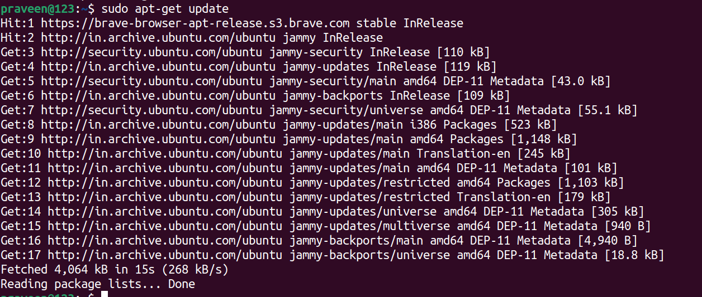


- **sudo:** "Sudo" stands for "Superuser Do." It is used in Linux to execute a command as the root (admin) user, allowing the command to run with root privileges.

- **apt-get:** This is a command used for package management on Linux. It helps in acquiring, installing, removing, and updating packages in the package management system.

- **update:** The "update" in this command is used to refresh the package management database with information about new packages. It provides the user with information about new packages and their versions, allowing them to be installed on the system.


## 1. Create a postgres container using podman

```
sudo apt install -y podman

```


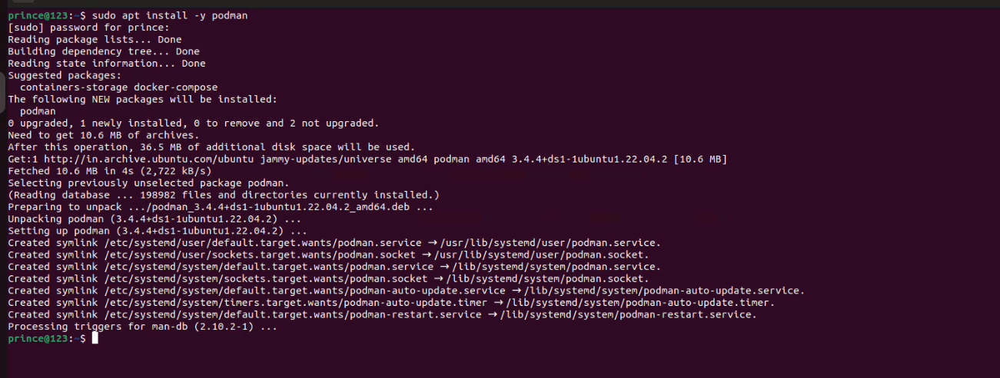


```
podman version
```

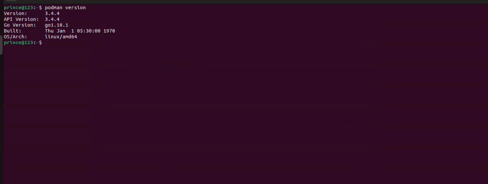


```
podman run --name postgres-container -e POSTGRES_PASSWORD=mysecretpassword -d -p 5432:5432 docker.io/library/postgres:latest

```

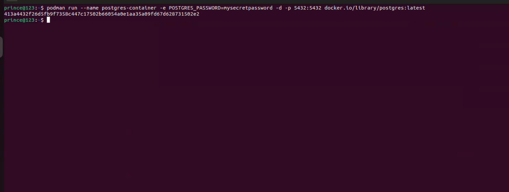

- **podman run:** This is the command used to run containers with Podman, an alternative containerization tool to Docker.

- **--name postgres-container:** This option specifies a custom name ("postgres-container") for the container. You can refer to the container by this name.

- **-e POSTGRES_PASSWORD=mysecretpassword:** This option sets an environment variable named "POSTGRES_PASSWORD" with the value "mysecretpassword." This is typically used to configure the password for the PostgreSQL database within the container.

- **-d:** This option runs the container in detached mode, which means it runs in the background, and you get the terminal prompt back for further commands.

- **-p 5432:5432:** This option maps port 5432 from the host to port 5432 inside the container. This allows you to access the PostgreSQL server running in the container through port 5432 on your host machine.

- **docker.io/library/postgres:latest:** This is the image name. It specifies the Docker image you want to run. In this case, it's "postgres" from the "library" repository on Docker Hub, using the "latest" tag.


## Verify that the PostgreSQL container is running:

```
podman ps
```

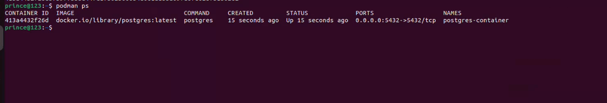

## Connect Postgres container


```
podman exec -it postgres-container psql -U postgres

```


- **podman:** This is the command-line tool for managing containers, similar to Docker.

- **exec:** This subcommand is used to execute a command within a running container.

- **-it:** These are options commonly used in container management to interact with the container's terminal (interactive mode).

- **postgres-container:** This is the name or ID of the container in which you want to execute the command.

- **psql -U postgres:** This is the command you want to execute inside the container. It's running the PostgreSQL command-line tool (psql) and connecting to the PostgreSQL database using the postgres user.


## 2.Create users,databases,tables and Extensions on the same.


## (a) Create Users
```
CREATE USER noida WITH PASSWORD 'noida1';
CREATE USER delhi WITH PASSWORD 'delhi1';
CREATE USER gurugram WITH PASSWORD 'gurugram1';
```


## (b) Databases
```
CREATE DATABASE my_database;

```


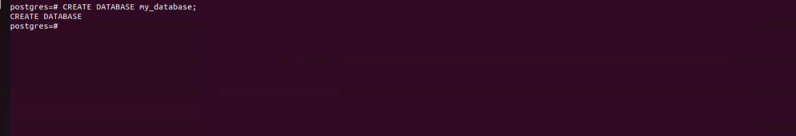


## (c) Tables

- connect database

```
\c my_database;
```


```
     CREATE TABLE users (
    id SERIAL PRIMARY KEY,
    first_name VARCHAR(50),
    last_name VARCHAR(50),
    email VARCHAR(100) UNIQUE
);


```

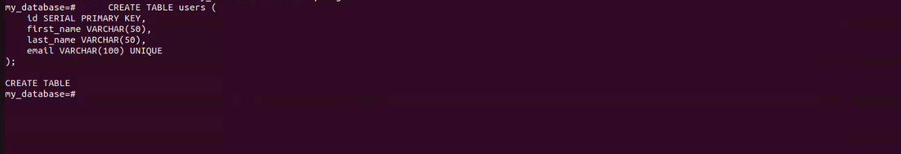


- **CREATE TABLE:** This keyword tells the database to create a new table.
  
- **my_table:** This is the name of the table that is being created.

- **id SERIAL NOT NULL PRIMARY KEY:** This column will store the unique identifier for each row in the table. The SERIAL data type means that the database will automatically generate a unique integer value for each new row that is inserted into the table. The NOT NULL constraint means that this column cannot be empty. The PRIMARY KEY constraint means that this column uniquely identifies each row in the table.

- **name VARCHAR(255) NOT NULL:** This column will store the name of each row in the table. The VARCHAR(255) data type means that this column can store up to 255 characters of text. The NOT NULL constraint means that this column cannot be empty.


## (d)  Extensions
```
CREATE EXTENSION pg_trgm;
```

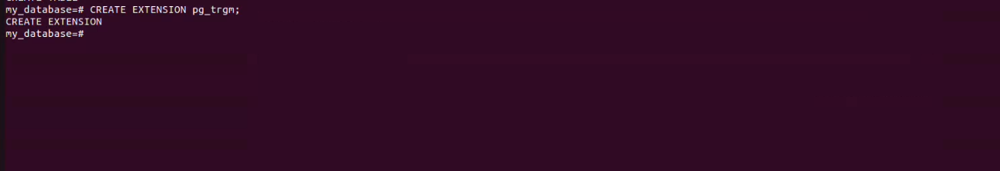

**EXTENSION** This SQL statement is used to create or activate an extension in the PostgreSQL database. Extensions are additional modules or functions that extend PostgreSQL database functionality.

**pg_trgm** This extension provides full-text search and trigram similarity capabilities in PostgreSQL.
Using full-text search, you can search for text in your data. Using Trigram similarity, you can calculate the similarity of text in your data.
What are the reasons for using these capabilities? For example, you can use these capabilities to search for contents in a website, to search for data in a database, or to search for documents in a document collection.


### 3.Perform crud operations.

**CRUD (Create, Read, Update, Delete)**

### (a)Create 
```
INSERT INTO users (first_name, last_name, email) VALUES ('John', 'Doe', 'john.doe@example.com');

```

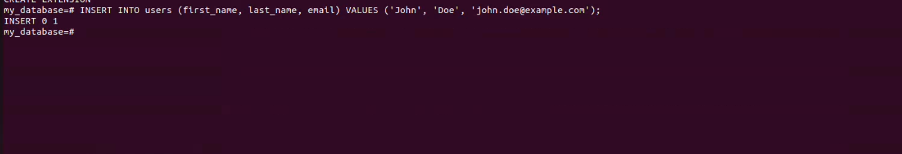


- **id:** A serial column that is the primary key of the table. This means that each row in the table will have a unique id value.
- **name:** A VARCHAR column that stores the name of the hospital.
- **address:** A VARCHAR column that stores the address of the hospital.
- **phone:** A VARCHAR column that stores the phone number of the hospital.
- **NOT NULL:** constraint on all of the columns means that each column must have a value. No rows will be inserted into the table if any of the columns are empty.
- **VARCHAR:** is a variable-length string data type in SQL. It means that it can store strings of any length, up to the maximum length specified when the column is created. It is a good choice for storing strings of variable length, such as names, addresses, and phone numbers.


## (b) Read
```
SELECT * FROM users;

```

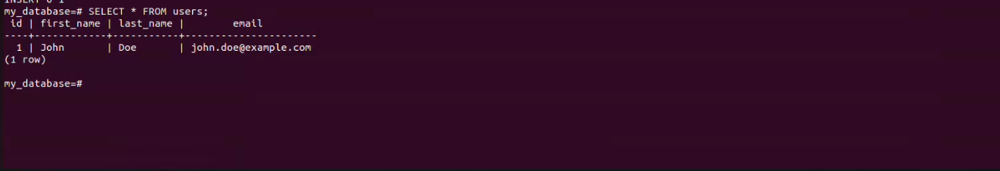


## (C ) Update


```
UPDATE users SET email = 'new.email@example.com' WHERE id = 1;

```

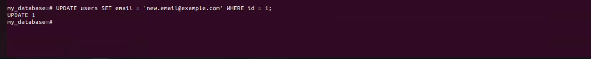

## (D) Delete
```
DELETE FROM users WHERE id = 1;

```

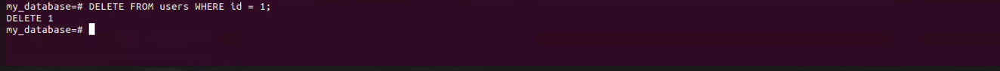


## 4. Create three users with a password.
```
CREATE ROLE user1 WITH LOGIN PASSWORD 'password1';
```
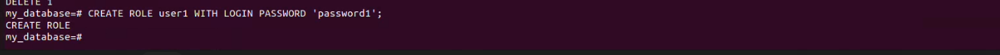

```
CREATE ROLE user2 WITH LOGIN PASSWORD 'password2';

```
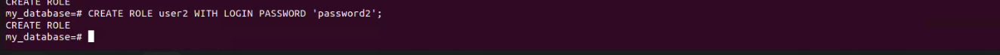

```
CREATE ROLE user3 WITH LOGIN PASSWORD 'password3';

```
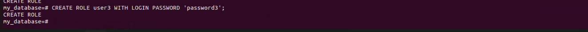

```
\du
```
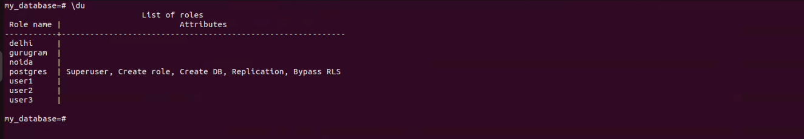
- show user


## 5. Grant select permission for user1,select,insert,delete for user2 and all for user3.

- Granting selection permission to user1:

```
GRANT SELECT ON public.users TO user1;
```


- To grant select, insert, and delete permissions to user2:

```
GRANT SELECT, INSERT, DELETE ON public.users TO user2;
```
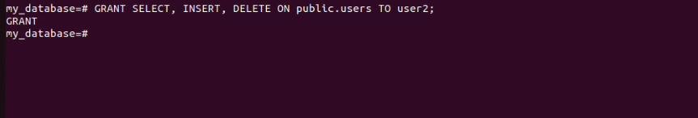

- Give all permissions to user3
```
GRANT ALL PRIVILEGES ON public.users TO user3;
```


### 6. Understanding the table structure,finding database size, table size etc.

**INSERT INTO**
```
INSERT INTO users (first_name, last_name, email)
VALUES
    ('John', 'Doe', 'john.doe@example.com'),
    ('Jane', 'Smith', 'jane.smith@example.com'),
    ('Alice', 'Johnson', 'alice.johnson@example.com'),
    ('Bob', 'Brown', 'bob.brown@example.com'),
    ('Eva', 'Davis', 'eva.davis@example.com'),
    ('Michael', 'Lee', 'michael.lee@example.com'),
    ('Samantha', 'Taylor', 'samantha.taylor@example.com'),
    ('William', 'Anderson', 'william.anderson@example.com'),
    ('Olivia', 'Moore', 'olivia.moore@example.com'),
    ('Daniel', 'Wilson', 'daniel.wilson@example.com');
```
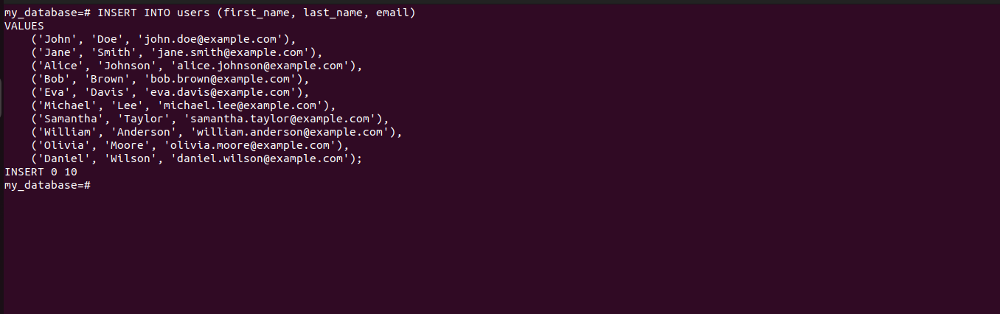

**(a) Table structure**
```
\d users
```

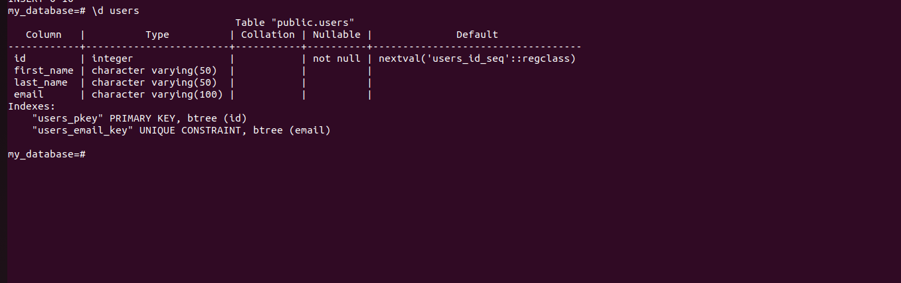


**(b) Finding database size**
```
SELECT pg_size_pretty(pg_database_size(current_database()));
```
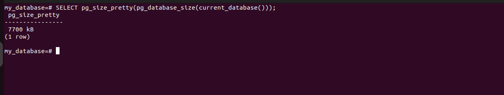


**(c) Table size**
```
SELECT pg_size_pretty(pg_total_relation_size('users'));
```
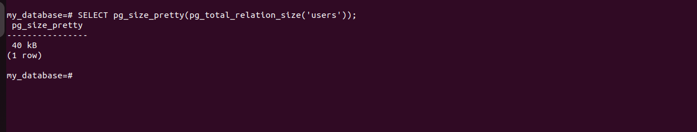


